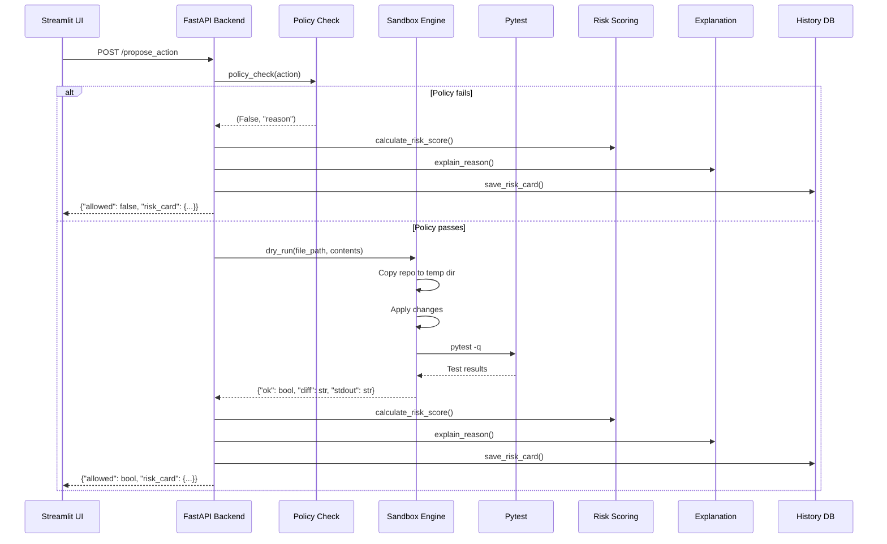

# Aegis Architecture

**Aegis is a seatbelt for AI helpers: policy → sandbox → tests → Risk Card.**

This document explains how Aegis works under the hood. If you're new to the codebase, start here to understand the big picture, then dive into specific components as needed.

## High-Level Overview

Aegis validates code changes before they're applied. Think of it as a safety checkpoint that:

1. **Checks policies** - Validates file paths, intents, and content structure
2. **Runs in sandbox** - Creates an isolated copy of your repo (local or cloud)
3. **Runs tests** - Executes your test suite to verify the changes work
4. **Generates Risk Card** - Produces a comprehensive assessment with score, explanation, and diff

If any step fails, the action is **BLOCKED**. All checks must pass for **ALLOW**.

## Request Flow

Here's what happens when you call `/propose_action`:



## Component Diagram

```
┌─────────────────────────────────────────────────────────────┐
│                        Streamlit UI                          │
│  (ui/ui.py) - Action Builder & Risk Card Display            │
└───────────────────────┬─────────────────────────────────────┘
                        │ HTTP
                        ▼
┌─────────────────────────────────────────────────────────────┐
│                    FastAPI Backend                           │
│  (app/app.py) - Main API endpoints                          │
└─────┬──────┬──────┬──────┬──────┬──────┬──────┬────────────┘
      │      │      │      │      │      │      │
      ▼      ▼      ▼      ▼      ▼      ▼      ▼
┌────────┐ ┌────────┐ ┌────────┐ ┌────────┐ ┌────────┐ ┌────────┐
│Guards  │ │Sandbox │ │Scoring │ │Explain │ │History │ │Metrics │
│        │ │        │ │        │ │        │ │        │ │        │
│Policy  │ │Local/  │ │Risk    │ │AI/Plain│ │SQLite  │ │Perf    │
│Rules   │ │Modal   │ │0-100   │ │Text    │ │DB      │ │Tracking│
└────────┘ └────────┘ └────────┘ └────────┘ └────────┘ └────────┘
```

### Module Responsibilities

- **`app/app.py`** - FastAPI application, routes, request handling
- **`app/guards.py`** - Policy validation (file paths, intents, content structure)
- **`app/dryrun_local.py`** - Local sandbox execution (copies `demo/`, runs pytest)
- **`app/modal_runner.py`** - Cloud sandbox via Modal (clones repo, runs pytest)
- **`app/risk_scoring.py`** - Calculates 0-100 risk score from checks and diff patterns
- **`app/explain.py`** - Generates human-readable explanations (AI-powered or plain text)
- **`app/diff_analysis.py`** - Analyzes diffs for risky patterns (DELETE, DROP, secrets)
- **`app/history.py`** - SQLite database for audit log and risk card history
- **`app/metrics.py`** - Performance tracking and request statistics
- **`app/webhooks.py`** - Optional webhook notifications
- **`app/openrouter.py`** - OpenRouter API client for AI explanations
- **`app/secrets.py`** - Reads API keys from files
- **`ui/ui.py`** - Streamlit frontend with Action Builder and Risk Card display

## Risk Card JSON Schema

A Risk Card is the core data structure returned by Aegis. Here's its schema:

### Fields

| Field | Type | Description |
|-------|------|-------------|
| `status` | `string` | `"allow"` or `"blocked"` |
| `checks` | `array` | List of `[name, passed, message]` tuples |
| `risk_score` | `integer` | 0-100 risk score |
| `explanation` | `string` | Human-readable explanation |
| `diff` | `string` | Unified diff of changes |
| `diff_analysis` | `object` | Pattern analysis (risky_patterns, sensitive_data) |
| `stdout` | `string` | Last 80 lines of pytest output |
| `ts` | `float` | Unix timestamp |
| `request_id` | `string` | Unique request identifier |
| `action` | `object` | Original action that was proposed |

### Example: SAFE Action

```json
{
  "status": "allow",
  "checks": [
    ["policy", true, "OK"],
    ["dry_run_tests", true, "pytest passed"]
  ],
  "risk_score": 10,
  "explanation": "Action is safe. all checks passed: policy, dry_run_tests. (2 added, 0 removed)",
  "diff": "--- config/app.yaml\n+++ config/app.yaml\n@@ -1,3 +1,3 @@\n service: web\n-pagination: 20\n+pagination: 50\n featureX: false",
  "diff_analysis": {
    "lines_added": 1,
    "lines_removed": 1,
    "risky_patterns": [],
    "sensitive_data": false,
    "summary": "1 line(s) added, 1 line(s) removed"
  },
  "stdout": "...",
  "ts": 1704067200.0,
  "request_id": "req_abc123def456"
}
```

### Example: BLOCKED Action

```json
{
  "status": "blocked",
  "checks": [
    ["policy", false, "Destructive intent blocked"]
  ],
  "risk_score": 70,
  "explanation": "Action is blocked due to failed checks: policy",
  "diff": "",
  "diff_analysis": {
    "lines_added": 0,
    "lines_removed": 0,
    "risky_patterns": [],
    "sensitive_data": false,
    "summary": "No changes detected"
  },
  "stdout": "",
  "ts": 1704067200.0,
  "request_id": "req_xyz789ghi012"
}
```

## Repository Structure

Aegis expects repositories to follow this structure:

```
repo/
├── config/
│   └── app.yaml          # Configuration files
├── flags/
│   └── rollout.json      # Feature flags
└── tests/
    └── test_config.py    # Pytest tests
```

### Swapping `demo/` for Any Repo

To use Aegis with your own repository:

1. **Local sandbox**: Replace the `demo/` directory with your repo structure
2. **Modal sandbox**: Set `DEMO_REPO=https://github.com/your-org/your-repo.git` in `.env`

Required folders:
- `config/` - For configuration files (validated by policy)
- `flags/` - For feature flags (validated by policy)
- `tests/` - For pytest test files (executed in sandbox)

The policy in `app/guards.py` enforces that only files under `config/` or `flags/` can be modified.

## Secrets Model

Aegis uses a simple, secure secrets model:

### `.env` File

Contains only non-sensitive configuration:
```bash
DEMO_REPO=https://github.com/your-org/your-repo.git
AEGIS_WEBHOOK_URL=https://your-webhook-url.com
```

**Why only `DEMO_REPO`?** This is a public GitHub URL, not a secret. It's in `.env` for convenience, not security.

### `OPENROUTER_API_KEY.txt`

Contains the OpenRouter API key (one line, no quotes):
```
sk-or-v1-abc123...
```

**Why a separate file?** API keys are sensitive and should not be in `.env` (which might be committed). This file is gitignored by default.

### Reading Secrets

- `.env` is loaded via `python-dotenv` at import time
- OpenRouter key is read via `app/secrets.py::read_openrouter_key()` which checks for `OPENROUTER_API_KEY.txt`

If either is missing, Aegis gracefully degrades:
- No `DEMO_REPO` → Falls back to local sandbox
- No OpenRouter key → Uses plain-English explanations

## FAQ

### Why was "Unsafe delete" blocked?

The "Unsafe delete" preset has `intent: "delete table"`. The policy check in `app/guards.py` blocks any intent containing the word "delete":

```python
if "delete" in action.get("intent","").lower():
    return False, "Destructive intent blocked"
```

This is a simple safety rule. You can modify it in `app/guards.py` to allow specific delete operations.

### What if Modal fails?

Aegis has graceful fallback:

1. If `use_modal=true` but Modal is not installed → Adds a check failure, falls back to local
2. If `use_modal=true` but `DEMO_REPO` is missing → Adds a check failure, falls back to local
3. If Modal execution fails → Catches exception, adds check failure, falls back to local

The action still proceeds with local sandbox, but the Modal check is recorded as failed in the Risk Card.

### How to add a new policy rule?

Edit `app/guards.py` in the `policy_check()` function. For example, to block changes to a specific file:

```python
def policy_check(action: dict):
    fp = action.get("file_path","")
    
    # Block changes to secrets.yaml
    if fp == "config/secrets.yaml":
        return False, "Secrets file cannot be modified"
    
    # ... rest of existing checks
```

### How to write tests?

Tests go in `demo/tests/` (or `tests/` in your repo). They're standard pytest tests. Example:

```python
# demo/tests/test_config.py
import yaml, os

def test_pagination_reasonable():
    with open(os.path.join("config","app.yaml")) as f:
        cfg = yaml.safe_load(f)
    assert 1 <= cfg["pagination"] <= 100
```

When Aegis runs the sandbox:
1. Copies your repo to a temp directory
2. Applies the proposed changes
3. Runs `pytest -q` in that directory
4. Captures stdout/stderr and return code

If any test fails, the action is blocked.

### How does risk scoring work?

Risk score (0-100) is calculated in `app/risk_scoring.py`:

- **Base score**: 50 if blocked, 10 if allowed
- **Failed checks**: +15 per failed check
- **Policy failures**: +20 extra
- **Test failures**: +25 extra
- **Risky patterns**: +8-15 per pattern (DELETE, DROP, etc.)
- **Large deletions**: +15 if >10 lines deleted

Score is capped at 100. Levels:
- 0-19: LOW (green)
- 20-49: MEDIUM (yellow)
- 50-79: HIGH (orange)
- 80-100: CRITICAL (red)

### How do explanations work?

Explanations are generated in `app/explain.py`:

1. **If OpenRouter key exists**: Calls Claude 3.5 Sonnet with risk card summary
2. **Otherwise**: Builds plain-English string from checks and diff

Both methods are capped at 280 characters and never crash (always return a string).

## Next Steps

- See [WALKTHROUGH.md](./WALKTHROUGH.md) for hands-on examples
- Check `app/guards.py` to understand policy rules
- Look at `demo/tests/test_config.py` for test examples
- Explore the UI at http://127.0.0.1:8501

